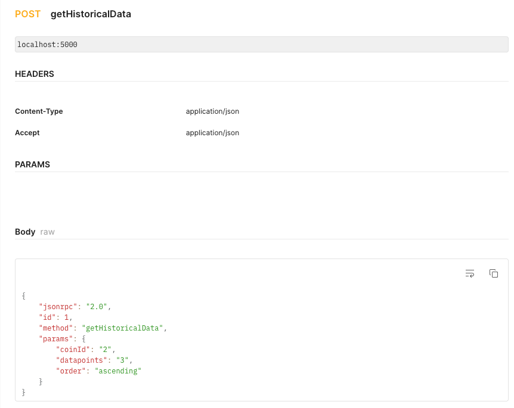

# JSON RPC API
## 

This JSON RPC API offers the following methods:
- **startApp** - Call this initially to run some initialization function
**Postman request:** 


- **getInfo** - Shows coin information for some or all coins tracked by your API
Parameters: 
*newCoins* - STRING or null - Comma delimited list of coins
For Example: bitcoin,tether
**Postman request:**


- **getHistoricalData** - Shows historical coin information for a specific coin from the time the request is made
Parameters: 
*coinId* - String, The coin id to query on, Range: [0,19], only valid ones from Method A
*numOfPoints* - Number or null - The number of historical datapoints to return, Max points stored = 100
*order* - STRING ENUM or null - [descending, ascending], Whether the result should be sorted by date, Default: descending
**Postman request:**


- **isTracked** - allows the requestor to instruct your API to enable/disable tracking for a specific coin
Parameters:
*coinId* - String, The coin id to query on, Range: [0,19], only valid ones from Method A
*track* - Boolean, Whether the coin should be tracked or untracked
**Postman request:**


## Coin Price Data Provider
I used Coin Cap as the coin data provider. Below is the API for it:
https://docs.coincap.io/#61e708a8-8876-4fb2-a418-86f12f308978

## Prequisites
- Install MongoSB Community edition by following all the steps here
https://www.mongodb.com/docs/manual/tutorial/install-mongodb-on-os-x-tarball/

- Follow steps in section "Run MongoDB Community Edition"
- Run MongoDB
```sh
mongod --dbpath /usr/local/var/mongodb --logpath /usr/local/var/log/mongodb/mongo.log --fork
```
- Verify that MongoDB has started successfully.
```sh
ps aux | grep -v grep | grep mongod
```

## Steps
- Run the following command which will install all the packages and start the app at port 5000
```sh
npm run build
```
- The application will be accessible at localhost:5000
- These are the versions for node and npm on my system
```sh
json-rpc-api % node --version
v18.14.0
json-rpc-api % npm --version
9.3.1
```
## Database
MongoDB is used to store the data. Scalability and Flexibility are main reasons to choose a no-SQL database like MongoDB. Helps in cases where data structure is not predefined, so it's easy to adapt. There are a limited number of coins, but the data associated with it (like historical data going back to years) can be enormous. Thus there is a one coin to many data relationship. This is easier to map out using mongoDB.

Mongoose is used as the Object Document Mapper (ODM). It provides a straight-forward, schema-based solution to model your application data. 

## Notes
- The queries call the database, and not the pricing data provider directly.
- The information from the coin data provider is stored in the database.
